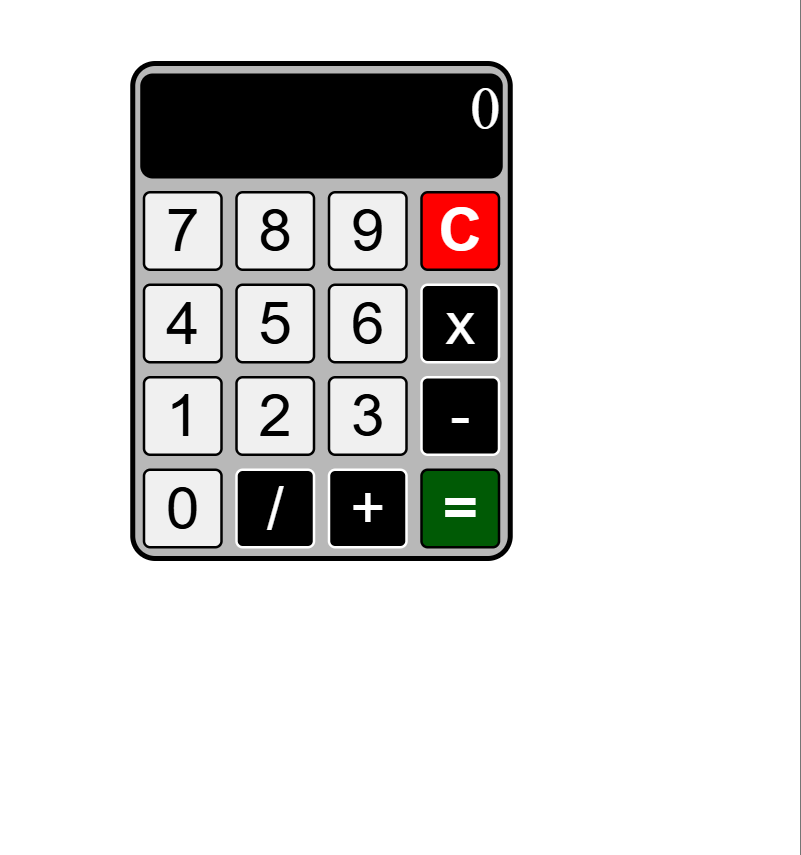

# 📟 Calculadora Básica

Uma calculadora simples e funcional desenvolvida com **HTML**, **CSS** e **JavaScript**. Este projeto é perfeito para quem deseja aprender ou praticar conceitos básicos de desenvolvimento web e manipulação do DOM.

---

## 📖 Sobre o Projeto

Esta calculadora permite realizar operações matemáticas básicas como:

- **Adição (+)**
- **Subtração (-)**
- **Multiplicação (x)**
- **Divisão (/)**

Além disso, ela conta com funcionalidades como:

- Botão **C** para limpar todos os valores.
- Exibição de resultados diretamente no visor.
- Destaque visual nos botões para melhorar a usabilidade.

---

## 🖼️ Captura de Tela



---

## 🛠️ Tecnologias Utilizadas

Este projeto foi construído utilizando as seguintes tecnologias:

- **HTML5**: Estrutura da aplicação.
- **CSS3**: Estilização dos botões e do visor.
- **JavaScript**: Lógica para manipulação dos valores e operações.

---

## 🚀 Como Usar

1. Clone este repositório para sua máquina local:
   ```bash
   git clone https://github.com/alecarvalho950/calculadoraBasica.git
